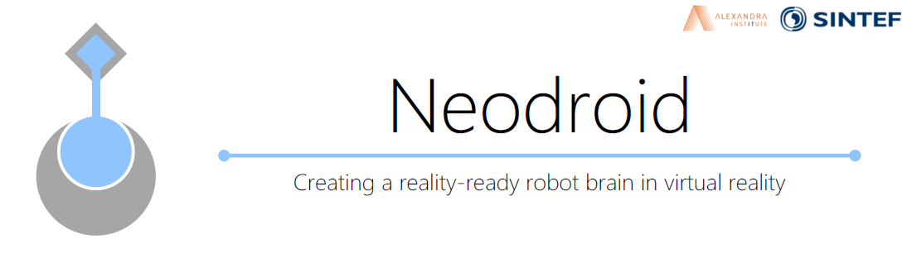

<!---->

<p align="center">
  
</p>

<h1 align="center">Audition</h1>

<!--# Audition-->

This repository will host implementation audio modality algorithms applied to the [Neodroid](https://github.com/sintefneodroid/) platform.

---

_[Neodroid](https://github.com/sintefneodroid) is developed with support from Research Council of Norway Grant #262900. ([https://www.forskningsradet.no/prosjektbanken/#/project/NFR/262900](https://www.forskningsradet.no/prosjektbanken/#/project/NFR/262900))_

---


[](https://badge.fury.io/py/repo)
[](https://pypi.org/project/repo/)
[](https://pepy.tech/project/repo)
[](https://actions-badge.atrox.dev/author/repo/goto?ref=master)
[](https://lhotse.readthedocs.io/en/latest/?badge=latest)
[](https://codecov.io/gh/author/repo)
[](https://colab.research.google.com/github/author/repo/blob/master/notebooks/repo-introduction.ipynb)

| [](https://travis-ci.org/sintefneodroid/agent)  | [](https://coveralls.io/github/sintefneodroid/agent?branch=master)  | [](https://github.com/sintefneodroid/agent/issues)  |  [](https://github.com/sintefneodroid/agent/network) | [](https://github.com/sintefneodroid/agent/stargazers) |[](https://github.com/sintefneodroid/agent/blob/master/LICENSE.md) | [](https://codescene.io/projects/12883) | [](https://codescene.io/projects/12883) |
|---|---|---|---|---|---|---|---|

<p align="center" width="100%">
  <a href="https://www.python.org/">
    
  </a>
  <a href="http://pytorch.org/"style="float: right;">
    
  </a>
</p>
<p align="center" width="100%">
  <a href="http://www.numpy.org/">
    
  </a>
  <a href="https://github.com/tqdm/tqdm" style="float:center;">
    
  </a>
</p>

# Contents Of This Readme

- [Algorithms](#algorithms)
- [Requirements](#requirements)
- [Usage](#usage)
- [Results](#results)
    - [Segmentation](#segmentation)
- [Contributing](#contributing)
- [Other Components](#other-components-of-the-neodroid-platform)

# Algorithms

- [SAGAN](vision/.py) - Generative model
- [CVAE](vision/.py) - Generative model
- [BVAE](vision/.py) - Generative model
- [Vanilla-CNN](vision/.py) - Classification
- [Vanilla-MLP](vision/.py) - Classification
- [YOLO](vision/.py) - Segmentation

# Requirements

- pytorch
- tqdm
- Pillow
- numpy
- matplotlib
- torchvision
- torch
- Neodroid
- pynput

To install these use the command:

````bash
pip3 install -r requirements.txt
````

# Usage

Export python path to the repo root so we can use the utilities module

````bash
export PYTHONPATH=/path-to-repo/
````

For training a agent use:

````bash
python3 procedures/train_agent.py
````

For testing a trained agent use:

````bash
python3 procedures/test_agent.py
````

# Results

## Segmentation

[Code](samples/regression/segmentation/run.py)

### Screenshots


# Contributing

See guidelines for contributing [here](CONTRIBUTING.md).

# Citation

For citation you may use the following bibtex entry:

````
@misc{neodroid-vision,
  author = {Heider, Christian},
  title = {Neodroid Vision},
  year = {2019},
  publisher = {GitHub},
  journal = {GitHub repository},
  howpublished = {\url{https://github.com/aivclab/vision}},
}
````

# Authors

* **Christian Heider Nielsen** - [cnheider](https://github.com/cnheider)

Here other [contributors](https://github.com/aivclab/vision/contributors) to this project are listed.
